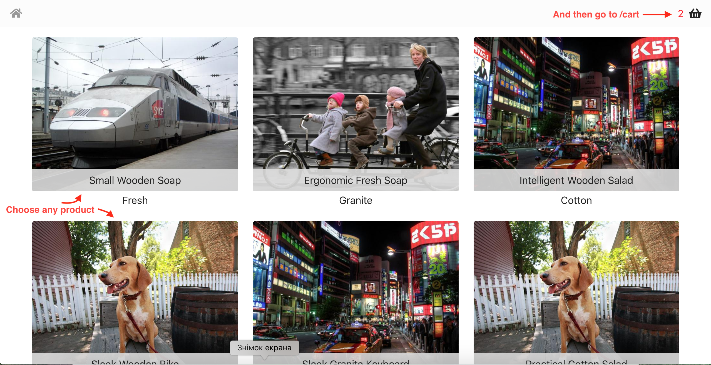

# reZet test

Front-End and Back-End parts are created independently.

## Prerequisites

1. For bundling and starting project [Yarn](https://yarnpkg.com/) must be installed.

> I use `yarn`, because it can handle workspaces out-the-box.

2. For getting project [Git](https://git-scm.com/) must be installed.
3. For testing project [Node](https://nodejs.org/en/) must be installed (I prefer 14.8.0, but LTS also works).

## Steps to test

At first clone project locally:

```sh
git clone https://github.com/YevhenKap/rezet-test.git
```

Then move into created directory:

```sh
cd rezet-test
```

And then:

```sh
yarn start
```

Last command install all dependencies, builds and optimizes code and starts server on `http://localhost:3000`.

## P.S.

I have created start page for all products with path `/`. There you can choose products to buy and navigate to basket (`/cart` page).

